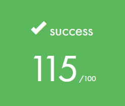

# Born2beroot
This project aims to introduce us to the wonderful world of virtualization.

### What is Born2beroot?
Born2beroot is an individual project in [42](https://www.42sp.org.br/) that requires us to create a virtual machine with an SSH server, firewall rules and as a bonus an installation of Wordpress and a service like FTP or DNS. The operating system can be Debian or CentOS and an operating system monitoring script.

#### Badge

#### Skills
- Rigor
- Network & system administration

#### My grade

